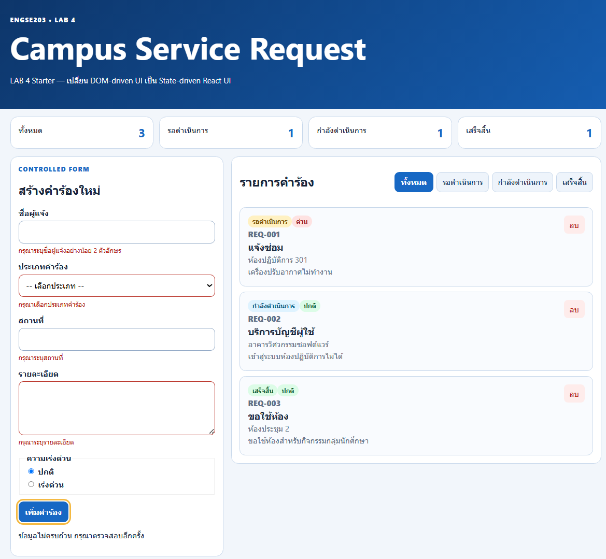
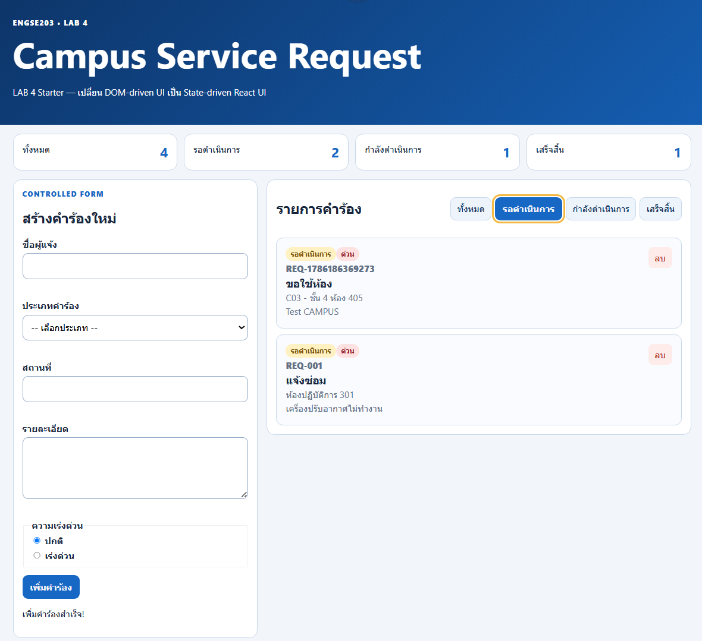
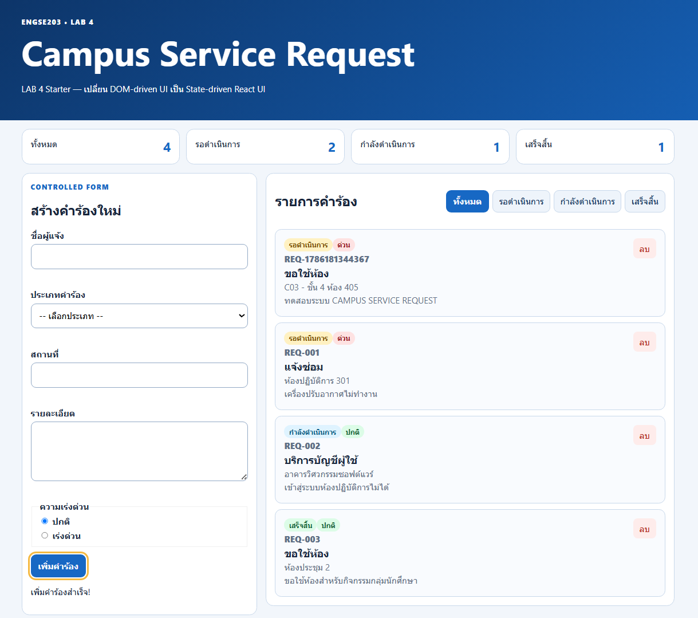
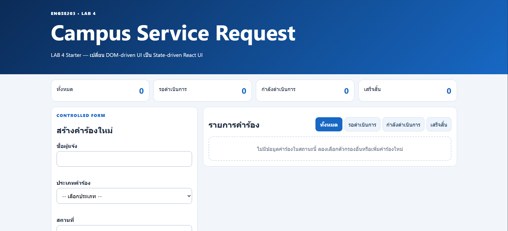
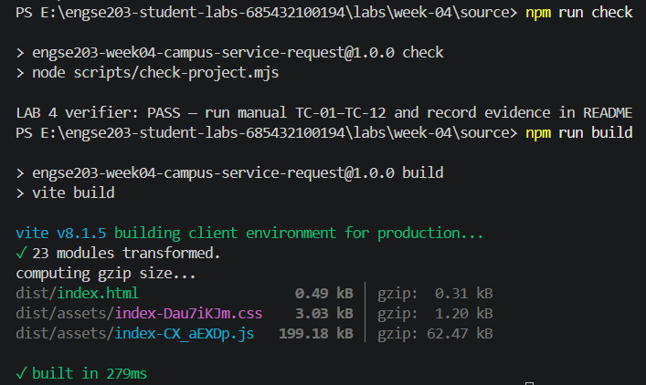
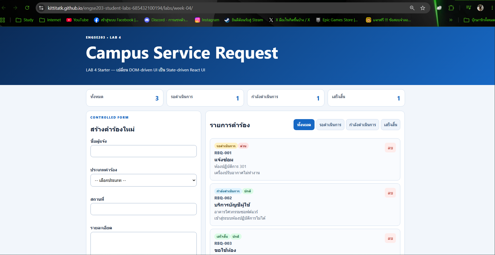
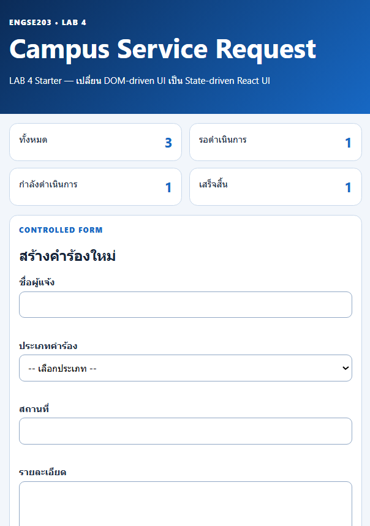
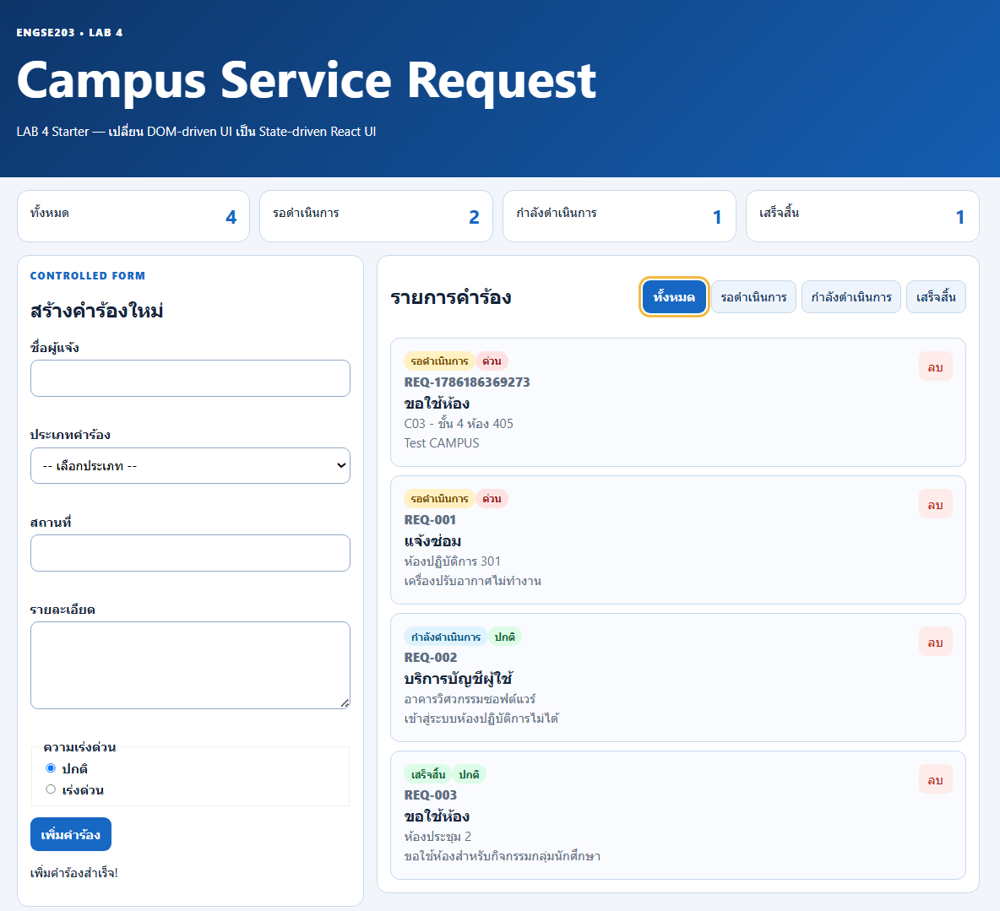

# 📋 Week 04 Evidence

**React State, Props & Callback — Test Evidence และผลการทดสอบ TC-01 ถึง TC-12**

**🔗 [Pull Request #15](https://github.com/KittitatK/engse203-student-labs-685432100194/pull/15)**

---

## 📌 สารบัญ

- [Test Evidence (TC-01–TC-12)](#-test-evidence-tc-01tc-12)
- [Screenshots](#-screenshots)
- [Reflection: State Ownership, Props และ Callback](#-reflection-state-ownership-props-และ-callback)
- [PR / Pages URL](#-pr--pages-url)

---

## ✅ Test Evidence (TC-01–TC-12)

| Test ID | Actual Result | Pass/Fail | Evidence |
|---|---|:---:|:---:|
| **TC-01** Initial | เปิดหน้ามาแสดงข้อมูล 3 ไฟล์ ชุดข้อมูลมาจาก `src/data/initailRequests.js` | ✅ PASS |  |
| **TC-02** Controlled input | เมื่อป้อนค่าในทุก ๆ ช่องแล้ว ค่าปรากฏใน state ทันที | ✅ PASS |  |
| **TC-03** Invalid | Submit ฟอร์มเปล่า/ข้อมูลไม่ครบ → error message แสดงใต้ช่องแต่ละช่อง ฟอร์มไม่ reset และไม่เพิ่มรายการใหม่ | ✅ PASS |  |
| **TC-04** Valid add | กรอกครบและถูกต้อง → รายการถูกเพิ่มเข้า list, ฟอร์ม reset กลับเป็นค่าเริ่มต้น, feedback ขึ้นข้อความ "เพิ่มรายการสำเร็จ" | ✅ PASS |  |
| **TC-05** Filter | คลิกปุ่มกรองสถานะ (เช่น "รอดำเนินการ", "กำลังดำเนินการ", "เสร็จสิ้น") จะแสดงเฉพาะ request ที่ status ตรงกัน | ✅ PASS |  |
| **TC-06** All | คลิกปุ่ม "ทั้งหมด" จะกลับมาแสดงครบทุก request อีกครั้ง | ✅ PASS |  |
| **TC-07** Empty | สถานะที่ไม่มีข้อมูลจะแสดง empty state "ยังไม่มีรายการในสถานะนี้" | ✅ PASS |  |
| **TC-08** Delete | กดปุ่ม "ลบ" ที่การ์ด → รายการหายไปจากลิสต์ทันที และ summary count ลดลงตาม | ✅ PASS |  |
| **TC-09** Mobile | ทดสอบที่ 375px เป็นหนึ่งคอลัมน์ ไม่มี horizontal scroll | ✅ PASS |  |
| **TC-10** Keyboard | focus-visible เห็นชัด (outline สีเหลือง), radio ใช้ลูกศรเลือกได้ | ✅ PASS |  |
| **TC-11** Build | `npm run check` และ `npm run build` ผ่านโดยไม่มี error/warning, ไม่มี React key warning ใน console | ✅ PASS |  |
| **TC-12** Pages | เปิด GitHub Pages URL ใน Incognito หน้าเว็บโหลดและทำงานได้ครบ ไม่มี asset 404 | ✅ PASS |  |

---

## 🖼️ Screenshots

<strong>มุมมองเดสก์ท็อป (Desktop)</strong>

 

<strong>มุมมองมือถือ (375px)</strong>

 

<strong>Validation — Success State</strong>

 

<strong>Validation — Error State</strong>

 

<strong>Validation — Empty State</strong>

 

---

## 💭 Reflection: State Ownership, Props และ Callback

### 🔹 State Ownership
แนวคิดในการพิจารณาว่า component ใดควรเป็นผู้เก็บและจัดการข้อมูล (`useState`) นั้นอย่างแท้จริง โดยหลักการที่ดีควรยก state ไปไว้ที่ component แม่ที่เป็น **"ศูนย์กลาง" (Closest Common Ancestor)** ของ component ลูกที่ต้องใช้ข้อมูลนั้น

ในโปรเจกต์นี้ `App` เป็น state owner ของ `requests` เพราะต้องกระจายข้อมูลไปให้ทั้ง `SummaryPanel` และ `RequestList` นำไปแสดงผล ในขณะเดียวกัน `RequestForm` ก็เป็น state owner ของตัวเอง (local state) เพื่อจัดการข้อมูลฟอร์มขณะที่ผู้ใช้กำลังพิมพ์ โดยไม่รบกวน state ของ component อื่น

### 🔹 Props
ย่อมาจาก *Properties* คือกลไกในการส่งข้อมูลจาก component แม่ (parent) ลงไปยัง component ลูก (child) เพื่อควบคุมการแสดงผล (การไหลของข้อมูลแบบ **Top-Down**)

ข้อมูลที่ส่งผ่าน props มีลักษณะเป็น **read-only** — component ลูกสามารถนำไปใช้อ่านและแสดงผลได้เท่านั้น แต่ไม่สามารถแก้ไขค่า props ได้โดยตรง เช่น การที่ `App` ส่ง `filteredRequests` ไปให้ `RequestList` เพื่อนำไปวนลูปแสดงการ์ดคำร้อง

### 🔹 Callback
คือฟังก์ชันที่ component แม่สร้างขึ้น แล้วส่งลงไปให้ component ลูกผ่าน props เพื่อใช้เป็นช่องทางให้ component ลูกสามารถส่งข้อมูลหรือแจ้งเตือนกลับมาหา component แม่ได้ (การไหลของข้อมูลแบบ **Bottom-Up**) เมื่อผู้ใช้กระทำเหตุการณ์ (event) ใด ๆ

เช่น การที่ `App` ส่งฟังก์ชัน `handleDeleteRequest` ลงไปผ่าน prop ที่ชื่อ `onDeleteRequest` เมื่อผู้ใช้กดปุ่มลบที่ `RequestCard` (ลูก) จะเป็นการเรียกใช้ฟังก์ชันนี้เพื่อไปสั่งอัปเดต state ที่ `App` (แม่)

---

## 🔗 PR / Pages URL

| รายการ | ลิงก์ |
|---|---|
| Pull Request | https://github.com/KittitatK/engse203-student-labs-685432100194/pull/15 |
| GitHub Pages | https://kittitatk.github.io/engse203-student-labs-685432100194/labs/week-04/ |