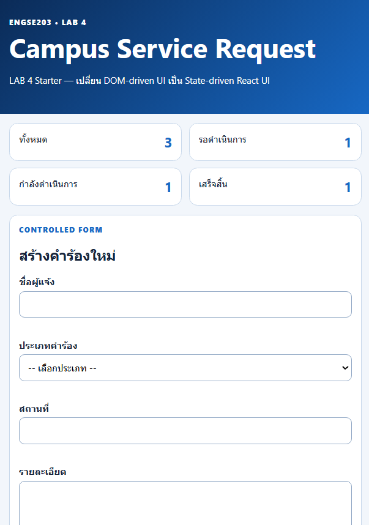
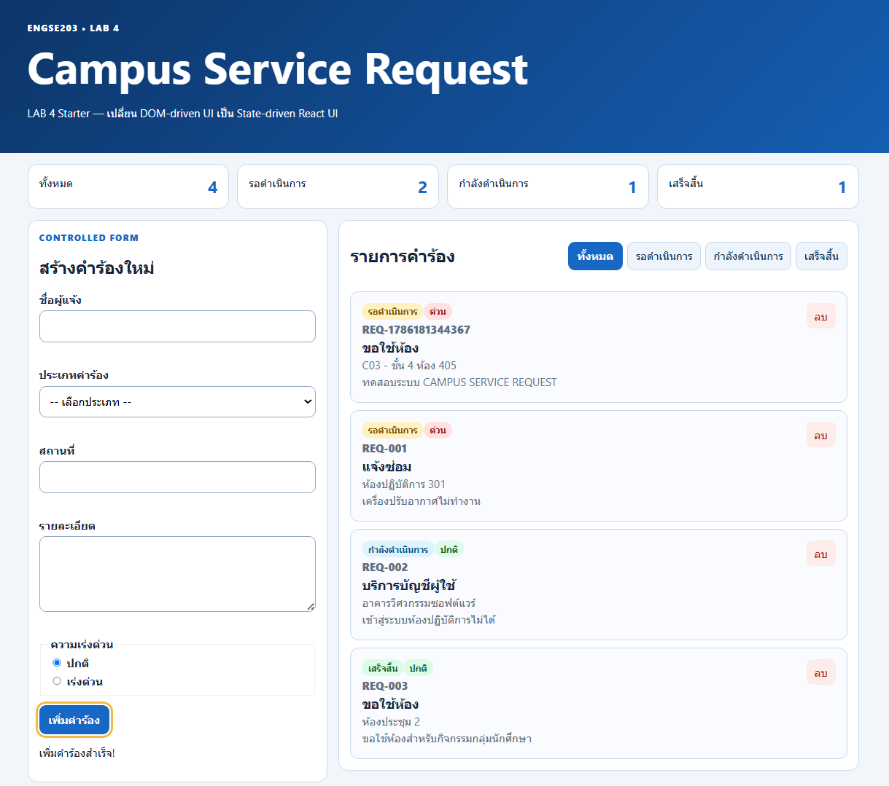
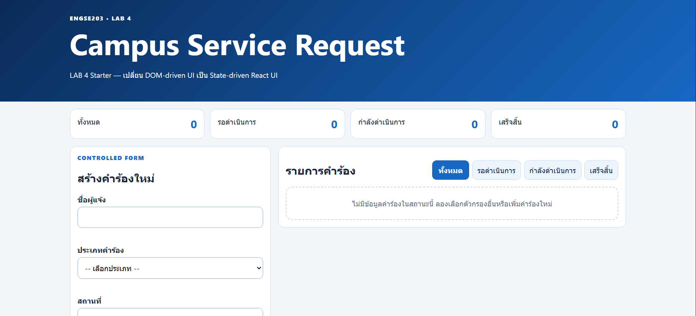

# ENGSE203 LAB 4 — Student Evidence README

## ผู้จัดทำ

- ชื่อ–นามสกุล: นาย กิตติทัต กันธรรม
- รหัสนักศึกษา: 68543210019-4
- Section: 1

## URLs

- Repository: https://github.com/KittitatK/engse203-student-labs-685432100194
- Pull Request: TODO
- GitHub Pages: TODO

## Component Tree

```text
App                                 [state: requests, statusFilter]
├── AppHeader                       [props: title, subtitle]
├── SummaryPanel                    [props: summary]
│   └── (map) summary card          [key: summary field name]
├── RequestForm                     [state: formData, errors, feedback]
│   └── (props received: onAddRequest)
└── section.panel (request list)
    ├── FilterBar                   [props: value, onFilterChange]
    └── RequestList                 [props: requests, onDeleteRequest]
        └── (map) RequestCard       [key: request.id]
                                    [props: request, onDeleteRequest]
```

## Setup และ Run

```bash
nvm use
npm install
npm run dev
npm run check
npm run build
npm run preview
```

## State / Props / Callback Explanation

TODO: อธิบายว่าใคร owns requests/filter/form state, props ไหลลงตรงไหน และ callback ไหลกลับตรงไหน

## Test Evidence

| Test ID | Actual Result | Pass/Fail | Evidence/Screenshot |
|---|---|---|---|
| TC-01 Initial | เปิดหน้ามาแสดงข้อมูล 3 ไฟล์ ชุดข้อมูลมาจาก src/data/initailRequests.js | PASS | TODO |
| TC-02 Controlled input | เมื่อป้อนค่าในทุกๆช่องแล้ว ค่าปรากฏใน state ทันที | PASS | TODO |
| TC-03 Invalid | Submit ฟอร์มเปล่า/ข้อมูลไม่ครบ → error message แสดงใต้ช่องแต่ละช่องฟอร์มจะไม่ reset และไม่เพิ่มรายการใหม่ | PASS | TODO |
| TC-04 Valid add | กรอกครบและถูกต้อง → รายการถูกเพิ่มเข้า list, ฟอร์ม reset กลับเป็นค่าเริ่มต้น, feedback ขึ้นข้อความ "เพิ่มรายการสำเร็จ" | PASS | TODO |
| TC-05 Filter | คลิกปุ่มกรองสถานะ (เช่น "รอดำเนินการ", "กำลังดำเนินการ" , "เสร็จสิน") จะแสดงเฉพาะ request ที่ status ตรงกัน | PASS | TODO |
| TC-06 All | 	คลิกปุ่ม "ทั้งหมด" จะกลับมาแสดงครบทุก request อีกครั้ง | PASS | TODO |
| TC-07 Empty | สถานะที่ไม่มีข้อมูลจะแสดง empty state "ยังไม่มีรายการในสถานะนี้"| PASS | TODO |
| TC-08 Delete | กดปุ่ม "ลบ" ที่การ์ด → รายการหายไปจากลิสต์ทันที และ summary count ลดลงตาม | PASS | TODO |
| TC-09 Mobile | ทดสอบที่ 375px เป็นหนึ่งคอลัมน์ ไม่มี horizontal scroll | PASS | TODO |
| TC-10 Keyboard |  focus-visible เห็นชัด (outline สีเหลือง), radio ใช้ลูกศรเลือกได้ | PASS | TODO |
| TC-11 Build | `npm run check` และ `npm run build` ผ่านโดยไม่มี error/warning, ไม่มี React key warning ใน console | PASS | TODO |
| TC-12 Pages | เปิด GitHub Pages URL ใน Incognito หน้าเว็บโหลดและทำงานได้ครบ ไม่มี asset 404 | PASS | TODO |

## Screenshots

- Desktop: `evidence/desktop.png`
    

- Mobile 375px: `evidence/mobile-375.png`
    

- Validation/empty state: 

Validation:
    

Empty State:
    

## Week 03 → Week 04 Reflection

การเขียนโค้ดแบบ DOM Mutation ในสัปดาห์ที่ 3 เราต้องคอยจัดการการเปลี่ยนแปลงของ UI โดยตรงผ่านคำสั่ง เช่น document.getElementById หรือ element.innerHTML ซึ่งทำให้โค้ดผูกติดกับโครงสร้าง HTML มากเกินไปและดูแลได้ยากเมื่อแอปพลิเคชันซับซ้อนขึ้น ในทางกลับกัน สัปดาห์ที่ 4 ซึ่งเปลี่ยนมาใช้ State-driven UI ด้วย React ทำให้เราสามารถโฟกัสไปที่การจัดการข้อมูล (State) เป็นหลักเพียงอย่างเดียว เมื่อ State เกิดการเปลี่ยนแปลง React จะรับหน้าที่คำนวณและอัปเดต UI ให้ตรงกับข้อมูลล่าสุดโดยอัตโนมัติ วิธีนี้ช่วยลดความผิดพลาด (Bugs) จากการลืมอัปเดต DOM บางจุด และทำให้กระบวนการเพิ่ม ลบ หรือกรองข้อมูลทำได้เป็นระบบและคาดเดาผลลัพธ์ได้ง่ายกว่าเดิมอย่างมาก

## AI / External Resource Disclosure

- **เครื่องมือที่ใช้:** Gemini,Claude
- **แหล่งอ้างอิงประกอบ:**
  - [ENGSE203-LAB (Sec1-2) — เอกสารประกอบวิชา](https://docs.google.com/document/d/1ozdylIgLqshdAaYyNvpAJIH6yJVn570cjs2TwXZ6MAo/edit?tab=t.0)
  - [week-04-react-components-state/pre-lab04 — se-rmutl/engse203-lab](https://github.com/se-rmutl/engse203-lab/tree/main/labs/week-04-react-components-state/pre-lab04)
  - [ENGSE203 Week 04 — React.js Fundamentals (Slides)](https://se-rmutl.github.io/engse203/week04)
- **Prompt/คำถามสำคัญที่ใช้ถาม:** ให้  Gemini,Claude ช่วยการแก้ไขข้อผิดพลาด (Error Message) ของ React ที่พบระหว่างการพัฒนา เช่น ปัญหาตัวแปรไม่ถูกนิยาม (request is not defined), ไฟล์ไม่เชื่อมกันเพราะใช้อักขระผิด , การพลาดจุดเล็กๆน้อยๆ เช่น ชื่อหรือsyntax ผิด และปัญหา React Key ซ้ำซ้อน นอกจากนี้ยังได้ขอคำอธิบายเพิ่มเติมเกี่ยวกับหลักการทำงานของ Object Spread Syntax (`{...obj}`) และ Computed Property Names (`[name]: value`) รวมถึงขอให้ช่วยตรวจสอบความถูกต้องของตรรกะในฟังก์ชันหลัก ได้แก่ `handleAddRequest, handleDeleteRequest และ validateRequest`
- **ส่วนที่นำมาปรับใช้:**
  - แก้อินพุตแบบ Uncontrolled (เช่น defaultValue ใน `<select>` และ defaultChecked ใน `<input type="radio">`) ให้เป็น Controlled Form โดยผูกกับ `value`, `checked={formData.priority === "..."}` และใช้ onChange จัดการ State
  - แก้ปัญหาป้ายสถานะ (Badge) บนการ์ดไม่แสดงสีตาม CSS โดยเพิ่มฟังก์ชัน `getStatusDisplay` ใน RequestCard เพื่อแมปค่า status ภาษาอังกฤษเป็นคลาส CSS (เช่น badge-pending) และข้อความภาษาไทย
  - แก้ตรรกะการแสดงป้าย "ความเร่งด่วน" บนการ์ด โดยใช้ Conditional Rendering เช็ค `request.priority === 'urgent' `เพื่อสลับการแสดงผลระหว่างป้ายสีแดง `(priority-high)` และป้ายสีเขียว `(priority-normal)`
  - เปลี่ยนการเรนเดอร์ใน RequestList ให้รองรับ Empty State โดยเพิ่มเงื่อนไขดักจับ if `(requests.length === 0) `เพื่อแสดงข้อความแจ้งเตือนแทนการปล่อยให้หน้าจอว่างเปล่าเมื่อไม่มีคำร้อง
  - แก้ไขและเพิ่มเติม CSS Selectors ในส่วนของ Accessibility `(:focus-visible` และ `[aria-invalid="true"])` ให้ครอบคลุมถึงแท็ก `<textarea>` เพื่อให้กรอบแจ้งเตือน Error (สีแดง) ทำงานได้สมบูรณ์กับทุกช่องกรอกข้อมูล

- **วิธีตรวจสอบความถูกต้อง:** ทดสอบรันจริงด้วย `npm run dev` หลังแก้ทุกจุด ตรวจสอบ browser console ว่าไม่มี error/warning เหลืออยู่, ทดสอบ flow เพิ่ม/ลบ/กรองข้อมูลด้วยตนเองซ้ำหลายรอบ, และรัน `npm run check` กับ `npm run build` ให้ผ่านก่อน commit ทุกครั้ง

