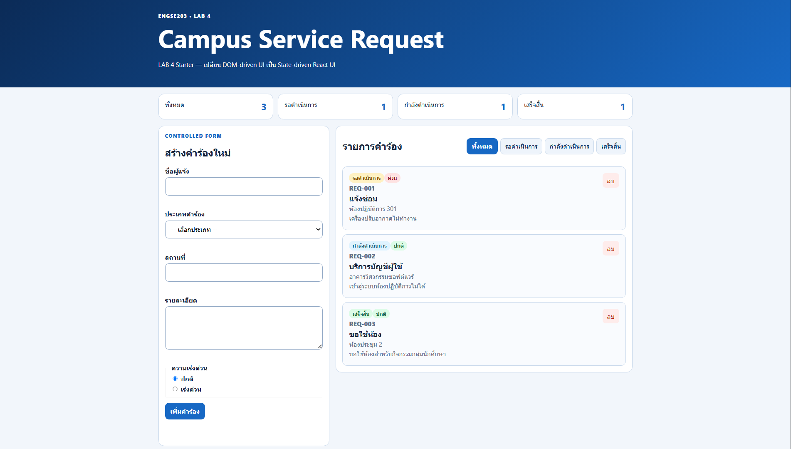
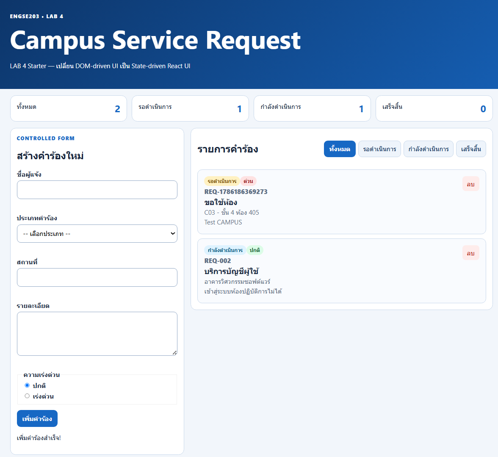
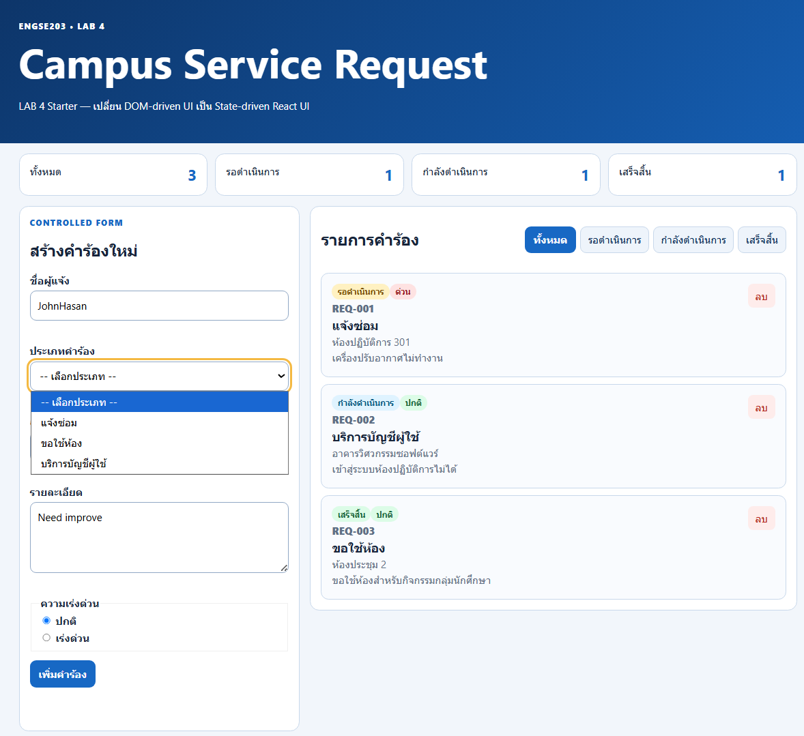

<div align="center">

# 📋 ENGSE203 LAB 4
### Student Evidence README — React Components & State

**🔗 [Repository](https://github.com/KittitatK/engse203-student-labs-685432100194)** &nbsp;|&nbsp; **🔀 [Pull Request #14](https://github.com/KittitatK/engse203-student-labs-685432100194/pull/14)** &nbsp;|&nbsp; **🌐 GitHub Pages:** *unknown*

</div>

---

## 👤 ผู้จัดทำ

| รายการ | รายละเอียด |
|---|---|
| ชื่อ–นามสกุล | นาย กิตติทัต กันธรรม |
| รหัสนักศึกษา | 68543210019-4 |
| Section | 1 |

---

## 📌 สารบัญ

- [Component Tree](#-component-tree)
- [Setup และ Run](#-setup-และ-run)
- [State / Props / Callback Explanation](#-state--props--callback-explanation)
- [Test Evidence](#-test-evidence)
- [Screenshots](#-screenshots)
- [Week 03 → Week 04 Reflection](#-week-03--week-04-reflection)
- [AI / External Resource Disclosure](#-ai--external-resource-disclosure)

---

## 🌳 Component Tree

```text
App                                 [state: requests, statusFilter]
├── AppHeader                       [props: title, subtitle]
├── SummaryPanel                    [props: summary]
│   └── (map) summary card          [key: summary field name]
├── RequestForm                     [state: formData, errors, feedback]
│   └── (props received: onAddRequest)
└── section.panel (request list)
    ├── FilterBar                   [props: value, onFilterChange]
    └── RequestList                 [props: requests, onDeleteRequest]
        └── (map) RequestCard       [key: request.id]
                                    [props: request, onDeleteRequest]
```

---

## 🚀 Setup และ Run

```bash
nvm use
npm install
npm run dev
npm run check
npm run build
npm run preview
```

---

## 🧩 State / Props / Callback Explanation

### 🔹 State Ownership
แนวคิดในการพิจารณาว่า component ใดควรเป็นผู้เก็บและจัดการข้อมูล (`useState`) นั้นอย่างแท้จริง โดยหลักการที่ดีควรยก state ไปไว้ที่ component แม่ที่เป็น **"ศูนย์กลาง" (Closest Common Ancestor)** ของ component ลูกที่ต้องใช้ข้อมูลนั้น

ในโปรเจกต์นี้ `App` เป็น state owner ของ `requests` เพราะต้องกระจายข้อมูลไปให้ทั้ง `SummaryPanel` และ `RequestList` นำไปแสดงผล ในขณะเดียวกัน `RequestForm` ก็เป็น state owner ของตัวเอง (local state) เพื่อจัดการข้อมูลฟอร์มขณะที่ผู้ใช้กำลังพิมพ์ โดยไม่รบกวน state ของ component อื่น

### 🔹 Props
ย่อมาจาก *Properties* คือกลไกในการส่งข้อมูลจาก component แม่ (parent) ลงไปยัง component ลูก (child) เพื่อควบคุมการแสดงผล (การไหลของข้อมูลแบบ **Top-Down**)

ข้อมูลที่ส่งผ่าน props มีลักษณะเป็น **read-only** — component ลูกสามารถนำไปใช้อ่านและแสดงผลได้เท่านั้น แต่ไม่สามารถแก้ไขค่า props ได้โดยตรง เช่น การที่ `App` ส่ง `filteredRequests` ไปให้ `RequestList` เพื่อนำไปวนลูปแสดงการ์ดคำร้อง

### 🔹 Callback
คือฟังก์ชันที่ component แม่สร้างขึ้น แล้วส่งลงไปให้ component ลูกผ่าน props เพื่อใช้เป็นช่องทางให้ component ลูกสามารถส่งข้อมูลหรือแจ้งเตือนกลับมาหา component แม่ได้ (การไหลของข้อมูลแบบ **Bottom-Up**) เมื่อผู้ใช้กระทำเหตุการณ์ (event) ใด ๆ

เช่น การที่ `App` ส่งฟังก์ชัน `handleDeleteRequest` ลงไปผ่าน prop ที่ชื่อ `onDeleteRequest` เมื่อผู้ใช้กดปุ่มลบที่ `RequestCard` (ลูก) จะเป็นการเรียกใช้ฟังก์ชันนี้เพื่อไปสั่งอัปเดต state ที่ `App` (แม่)

---

## ✅ Test Evidence

| Test ID | Actual Result | Pass/Fail | Evidence |
|---|---|:---:|:---:|
| **TC-01** Initial | เปิดหน้ามาแสดงข้อมูล 3 ไฟล์ ชุดข้อมูลมาจาก `src/data/initailRequests.js` | ✅ PASS |  |
| **TC-02** Controlled input | เมื่อป้อนค่าในทุก ๆ ช่องแล้ว ค่าปรากฏใน state ทันที | ✅ PASS |  |
| **TC-03** Invalid | Submit ฟอร์มเปล่า/ข้อมูลไม่ครบ → error message แสดงใต้ช่องแต่ละช่อง ฟอร์มไม่ reset และไม่เพิ่มรายการใหม่ | ✅ PASS |  |
| **TC-04** Valid add | กรอกครบและถูกต้อง → รายการถูกเพิ่มเข้า list, ฟอร์ม reset กลับเป็นค่าเริ่มต้น, feedback ขึ้นข้อความ "เพิ่มรายการสำเร็จ" | ✅ PASS |  |
| **TC-05** Filter | คลิกปุ่มกรองสถานะ (เช่น "รอดำเนินการ", "กำลังดำเนินการ", "เสร็จสิ้น") จะแสดงเฉพาะ request ที่ status ตรงกัน | ✅ PASS |  |
| **TC-06** All | คลิกปุ่ม "ทั้งหมด" จะกลับมาแสดงครบทุก request อีกครั้ง | ✅ PASS |  |
| **TC-07** Empty | สถานะที่ไม่มีข้อมูลจะแสดง empty state "ยังไม่มีรายการในสถานะนี้" | ✅ PASS |  |
| **TC-08** Delete | กดปุ่ม "ลบ" ที่การ์ด → รายการหายไปจากลิสต์ทันที และ summary count ลดลงตาม | ✅ PASS |  |
| **TC-09** Mobile | ทดสอบที่ 375px เป็นหนึ่งคอลัมน์ ไม่มี horizontal scroll | ✅ PASS |  |
| **TC-10** Keyboard | focus-visible เห็นชัด (outline สีเหลือง), radio ใช้ลูกศรเลือกได้ | ✅ PASS |  |
| **TC-11** Build | `npm run check` และ `npm run build` ผ่านโดยไม่มี error/warning, ไม่มี React key warning ใน console | ✅ PASS |  |
| **TC-12** Pages | เปิด GitHub Pages URL ใน Incognito หน้าเว็บโหลดและทำงานได้ครบ ไม่มี asset 404 | ✅ PASS | *ไม่มีภาพประกอบ* |

---

## 🖼️ Screenshots

<details open>
<summary><strong>มุมมองเดสก์ท็อป (Desktop)</strong></summary>
<br>


<sub>อ้างอิงไฟล์: <code>evidence/desktop.png</code></sub>
</details>

<details open>
<summary><strong>มุมมองมือถือ (Mobile 375px)</strong></summary>
<br>


<sub>อ้างอิงไฟล์: <code>evidence/mobile-375.png</code></sub>
</details>

<details open>
<summary><strong>Validation State</strong></summary>
<br>

</details>

<details open>
<summary><strong>Empty State</strong></summary>
<br>

</details>

---

## 💭 Week 03 → Week 04 Reflection

การเขียนโค้ดแบบ **DOM Mutation** ในสัปดาห์ที่ 3 เราต้องคอยจัดการการเปลี่ยนแปลงของ UI โดยตรงผ่านคำสั่ง เช่น `document.getElementById` หรือ `element.innerHTML` ซึ่งทำให้โค้ดผูกติดกับโครงสร้าง HTML มากเกินไปและดูแลได้ยากเมื่อแอปพลิเคชันซับซ้อนขึ้น

ในทางกลับกัน สัปดาห์ที่ 4 ซึ่งเปลี่ยนมาใช้ **State-driven UI** ด้วย React ทำให้เราสามารถโฟกัสไปที่การจัดการข้อมูล (state) เป็นหลักเพียงอย่างเดียว เมื่อ state เกิดการเปลี่ยนแปลง React จะรับหน้าที่คำนวณและอัปเดต UI ให้ตรงกับข้อมูลล่าสุดโดยอัตโนมัติ วิธีนี้ช่วยลดความผิดพลาด (bugs) จากการลืมอัปเดต DOM บางจุด และทำให้กระบวนการเพิ่ม ลบ หรือกรองข้อมูลทำได้เป็นระบบและคาดเดาผลลัพธ์ได้ง่ายกว่าเดิมอย่างมาก

---

## 🤖 AI / External Resource Disclosure

**เครื่องมือที่ใช้:** Gemini, Claude

**แหล่งอ้างอิงประกอบ:**
- [ENGSE203-LAB (Sec1-2) — เอกสารประกอบวิชา](https://docs.google.com/document/d/1ozdylIgLqshdAaYyNvpAJIH6yJVn570cjs2TwXZ6MAo/edit?tab=t.0)
- [week-04-react-components-state/pre-lab04 — se-rmutl/engse203-lab](https://github.com/se-rmutl/engse203-lab/tree/main/labs/week-04-react-components-state/pre-lab04)
- [ENGSE203 Week 04 — React.js Fundamentals (Slides)](https://se-rmutl.github.io/engse203/week04)

**Prompt/คำถามสำคัญที่ใช้ถาม:**
ให้ Gemini และ Claude ช่วยแก้ไขข้อผิดพลาด (error message) ของ React ที่พบระหว่างการพัฒนา เช่น ปัญหาตัวแปรไม่ถูกนิยาม (`request is not defined`), ไฟล์ไม่เชื่อมกันเพราะใช้อักขระผิด, การพลาดจุดเล็ก ๆ น้อย ๆ เช่น ชื่อหรือ syntax ผิด และปัญหา React key ซ้ำซ้อน นอกจากนี้ยังได้ขอคำอธิบายเพิ่มเติมเกี่ยวกับหลักการทำงานของ Object Spread Syntax (`{...obj}`) และ Computed Property Names (`[name]: value`) รวมถึงขอให้ช่วยตรวจสอบความถูกต้องของตรรกะในฟังก์ชันหลัก ได้แก่ `handleAddRequest`, `handleDeleteRequest` และ `validateRequest`

**ส่วนที่นำมาปรับใช้:**
- แก้อินพุตแบบ Uncontrolled (เช่น `defaultValue` ใน `<select>` และ `defaultChecked` ใน `<input type="radio">`) ให้เป็น Controlled Form โดยผูกกับ `value`, `checked={formData.priority === "..."}` และใช้ `onChange` จัดการ state
- แก้ปัญหาป้ายสถานะ (badge) บนการ์ดไม่แสดงสีตาม CSS โดยเพิ่มฟังก์ชัน `getStatusDisplay` ใน `RequestCard` เพื่อแมปค่า status ภาษาอังกฤษเป็นคลาส CSS (เช่น `badge-pending`) และข้อความภาษาไทย
- แก้ตรรกะการแสดงป้าย "ความเร่งด่วน" บนการ์ด โดยใช้ conditional rendering เช็ค `request.priority === 'urgent'` เพื่อสลับการแสดงผลระหว่างป้ายสีแดง (`priority-high`) และป้ายสีเขียว (`priority-normal`)
- เปลี่ยนการเรนเดอร์ใน `RequestList` ให้รองรับ empty state โดยเพิ่มเงื่อนไขดักจับ `if (requests.length === 0)` เพื่อแสดงข้อความแจ้งเตือนแทนการปล่อยให้หน้าจอว่างเปล่าเมื่อไม่มีคำร้อง
- แก้ไขและเพิ่มเติม CSS selectors ในส่วนของ accessibility (`:focus-visible` และ `[aria-invalid="true"]`) ให้ครอบคลุมถึงแท็ก `<textarea>` เพื่อให้กรอบแจ้งเตือน error (สีแดง) ทำงานได้สมบูรณ์กับทุกช่องกรอกข้อมูล

**วิธีตรวจสอบความถูกต้อง:**
ทดสอบรันจริงด้วย `npm run dev` หลังแก้ทุกจุด ตรวจสอบ browser console ว่าไม่มี error/warning เหลืออยู่ ทดสอบ flow เพิ่ม/ลบ/กรองข้อมูลด้วยตนเองซ้ำหลายรอบ และรัน `npm run check` กับ `npm run build` ให้ผ่านก่อน commit ทุกครั้ง